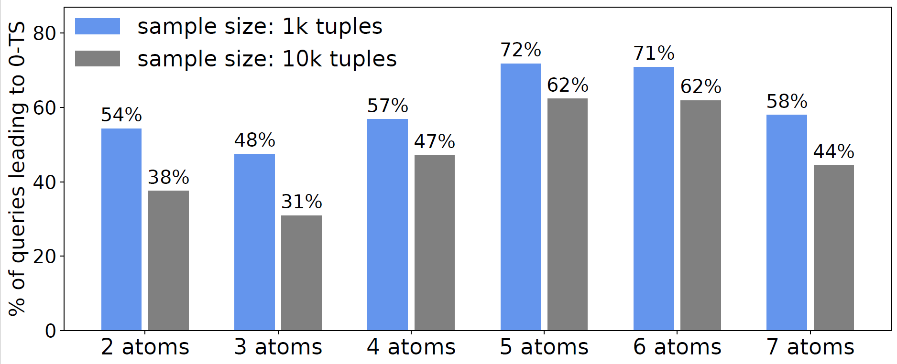

# BetaEstimator

Repository of the paper [Small Selectivities Matter: Lifting the Burden of Empty Samples](https://dl.acm.org/doi/10.1145/3448016.3452805). Given a sample, the Beta Estimator derives more precise selectivity estimates
when no sample tuple matches the filter (0-TS). 

The figure below illustrates the relative number of queries that result in 0-TS when using two standard sized random samples. Interestingly, and contrary to the intuition of being a corner case, the analysis of this real-life workload reveals that up to 72\% of the queries with complex conjunctive filter predicates (atoms) lead to empty samples.

To handle 0-TS, we take the certainty of selectivity estimates for subexpressions (subsets of predicates) into account. Our key insight: Accounting for the uncertainty and estimating correlations that are not captured by the sample drastically improves estimation accuracy and plan quality. In our work we  demonstrate that the Beta Estimator consistently outperforms prior work in 0-TS, while showing that the traditional estimate remains competitive in non-0-TS.

## Quick Start

Please find the Python running example in "PythonExample". You may need to install additional pyhton-packages as can be found in the import-clauses. Simply use "python3 evalForest.py" to run 10k queries on the forest data set and get the estimated cardinality with regard to the sample. To see how our estimator integrates with predicate enumeration run "python3 run_BetaGH.py".  

The basic implementation of Algorithm 1 (partialEstimate) using Brent's method can be found in SolverC++. Please compile with the optimization flag "-O2" and then run the executable as usual. The procedure will read in a file with precomputed parameters (e.g. using betaEstimator.py) and outputs the estimated selectivity. 
